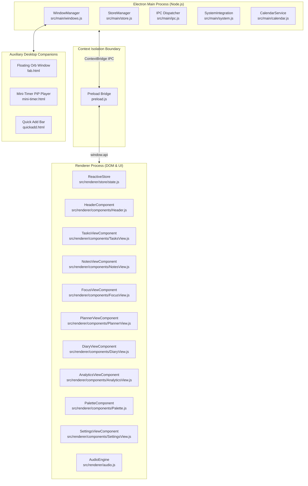

# Doing It — Technical Architecture & Developer Reference

> **Comprehensive Developer & Contributor Guide**  
> *Target Audience: Core Engineers, Contributors & Future Maintainers*  
> *Release Track: v4.4.x*

---

## Table of Contents
1. [System Overview & Architecture](#1-system-overview--architecture)
2. [Process Model & Security Boundaries](#2-process-model--security-boundaries)
3. [Window Management & Multi-Window Topology](#3-window-management--multi-window-topology)
4. [IPC Communication Architecture](#4-ipc-communication-architecture)
5. [Strict Invariant Constraints](#5-strict-invariant-constraints)
6. [Data Storage, Atomic Writes & Rolling Backups](#6-data-storage-atomic-writes--rolling-backups)
7. [Modular UI Components & Reactive Store](#7-modular-ui-components--reactive-store)
8. [Procedural Audio Synthesizer (Web Audio API)](#8-procedural-audio-synthesizer-web-audio-api)
9. [RFC 5545 iCalendar Engine](#9-rfc-5545-icalendar-engine)
10. [Packaging, NSIS Installer & App Icons](#10-packaging-nsis-installer--app-icons)
11. [Testing & Quality Verification](#11-testing--quality-verification)

---

## 1. System Overview & Architecture

**Doing It** is a desktop productivity overlay engineered for Windows 10 and Windows 11. It unifies rapid task management, markdown notes, a Pomodoro focus timer with procedural ambient sound, a daily journal with voice reflections, productivity rhythm analytics, and RFC 5545 calendar feeds into a lightweight, local-first companion widget.



---

## 2. Process Model & Security Boundaries

The application strictly implements Electron security hardening:
* `contextIsolation: true` across all BrowserWindows.
* `nodeIntegration: false` across all renderer contexts.
* **Custom Protocol**: `doingit-media://` is registered in the main process to stream locally saved images and WebM audio notes (`recordings/`) without granting unrestricted `file://` access.
* **DOM Sanitization**: User markdown input is parsed and sanitized through `DOMPurify` before rendering to prevent script injection.
* **Bounded Subprocesses**: PowerShell queries (such as active foreground window detection via `user32.dll` and Focus Assist registry modifications) execute with strict timeouts (2–3 seconds) and result caching.

---

## 3. Window Management & Multi-Window Topology

All application windows are instantiated, coordinated, and positioned in [`src/main/windows.js`](src/main/windows.js):

| Window | Dimensions | File | Purpose & Invariants |
| :--- | :--- | :--- | :--- |
| **Main Widget** | 400×650 (resizable: 360–680w, 520–max h) | `index.html` | Frameless (`frame: false, transparent: true`). Restores persisted dimensions on startup. Edge-docks with Windows screen borders. |
| **FAB Window** | 48×48 | `fab.html` | Draggable floating desktop companion. Displays the crisp app logo (`assets/icon.png`) with drop-shadow and SVG countdown progress ring. Shown when main window is minimized. |
| **Mini-Timer** | 290×50 | `mini-timer.html` | Picture-in-Picture countdown pill. Standalone drag handle, play/pause toggle, linked task ticker, and restore button. |
| **Quick Add** | 520×68 | `quickadd.html` | Spotlight-style global capture bar triggered via shortcut (`Ctrl+Shift+A`). Features real-time Chrono NLP preview. |
| **Settings** | Modal overlay | In-App (`index.html`) | Embedded preferences interface replacing detached popup windows. |

### Minimizing & Restoring Lifecycle
* When the user presses `Esc` or clicks Minimize in the header:
  1. Main window is hidden (`mainWindow.hide()`).
  2. If `disableFab` is `false` in settings, FAB window is displayed at its persisted desktop coordinates (`fabWindow.show()`).
* Clicking the floating orb immediately hides the FAB and brings the main window to the foreground (`mainWindow.show(); mainWindow.focus();`).

---

## 4. IPC Communication Architecture

The preload context bridge (`preload.js`) exposes validated methods via `window.api`. All IPC communication follows structured request-reply or one-way notification semantics:

| Channel Name | Direction | Payload | Functional Responsibility |
|---|---|---|---|
| `get-todos` / `save-todos` | Two-way | Array of tasks | Read and write task entities |
| `get-notes` / `save-notes` | Two-way | Array of notes | Read and write note records |
| `get-diary` / `save-diary` | Two-way | Array of diary entries | Read and write daily journal entries |
| `get-focus-history` / `log-focus-session` | Two-way | Session record | Log and analyze focus session records |
| `save-audio-recording` | Two-way | Base64 audio & filename | Store voice memo file into `recordings/` |
| `export-diary-markdown` | Two-way | Diary data | Save formatted `.md` file to user chosen path |
| `get-pomodoro` / `save-pomodoro` | Two-way | Focus state object | Synchronize timer duration and session logs |
| `get-settings` / `save-settings` | Two-way | Settings schema | Update preferences and trigger live theme broadcast |
| `choose-directory` | Two-way | None | Invoke native Windows directory selection dialog |
| `get-current-store-path` | Two-way | None | Query resolved path of active data store |
| `quick-add-save` | Renderer -> Main | Raw string | Parse quick capture string and route to tasks or notes |
| `pop-out-timer` | Renderer -> Main | Timer state | Spawn detached Picture-in-Picture window |
| `mini-timer-update` | Renderer -> Main | Countdown state | Broadcast countdown ticks to FAB and PiP companions |
| `fetch-ics-calendar` | Two-way | URL string | Download remote iCalendar feed and parse events |
| `get-active-window` | Two-way | None | Execute cached PowerShell WinAPI foreground title query |
| `save-clipboard-image` | Two-way | None | Extract clipboard image data and serialize to PNG |
| `toggle-focus-assist` | Two-way | State ('on' / 'off') | Modify Windows Focus Assist registry value |
| `toggle-pin-window` | Two-way | Boolean | Toggle always-on-top window pinning |
| `uninstall-app` | Renderer -> Main | None | Spawn uninstaller executable and terminate process |

---

## 5. Strict Invariant Constraints

The following structural configurations are **mandatory** for correct window rendering and must **never** be altered:

1. **Window Transparency & Frameless Invariants**:
   - `main.js`: Must configure `frame: false, transparent: true, backgroundColor: '#00000000'`.
   - `src/renderer/theme.css`: Must apply `clip-path: inset(0 round 8px)` to `body` for clean anti-aliased border radius on transparent viewports.
   - Do not set CSS `border-radius` directly on root containers when `clip-path` handles viewport rounding; mixing them introduces rendering artifacts.

2. **App Icons & Packaging**:
   - `build/icon.ico`: Master Windows icon for NSIS installer packaging.
   - `assets/icon.ico`: Runtime app icon for BrowserWindow instances.
   - `assets/icon.png`: Master high-resolution 256×256 app logo.
   - `afterPack.js`: Patches the executable icon directly via `rcedit`. Never remove this hook.

3. **Zero-Emoji UI Rule**:
   - The UI strictly enforces clean vector SVGs for all icons and badges.
   - Unit tests in `test/components.test.js` verify that source templates contain zero raw emoji characters.

---

## 6. Data Storage, Atomic Writes & Rolling Backups

All user state is managed by [`src/main/store.js`](src/main/store.js):

```
Data Flow:
[User Action] --> [ReactiveStore] --> [ContextBridge IPC] --> [StoreManager]
                                                                  |
                                                                  v
                                               [Atomic Staging: file.tmp]
                                                                  |
                                                                  v
                                                  [RenameSync: target.json]
                                                                  |
                                                                  v
                                               [Rolling Daily Backups (5d)]
```

* **Atomic File Writes**: Serializes updates to isolated temporary staging files (`doing-it-data.json.<timestamp>.tmp`) before executing atomic replacements via filesystem rename. Ensures resilience against sudden termination or power disruptions.
* **Bring Your Own Cloud (BYOC)**: Storage directories can be redirected to cloud-synchronized folders (OneDrive, Google Drive, Dropbox) while retaining local pointer references.
* **Automated Daily Backups**: Captures snapshot backups on application startup, enforcing a rolling 5-day retention policy with automatic corrupt-store self-healing.
* **Background Asset Garbage Collection**: Asynchronous background cleanup sweeps the local image directory 30 seconds post-boot, removing unreferenced image files.

---

## 7. Modular UI Components & Reactive Store

The frontend architecture uses a lightweight, reactive state store ([`src/renderer/store/state.js`](src/renderer/store/state.js)) and modular ES6 view controllers:

- **TasksView** (`src/renderer/components/TasksView.js`):
  - Natural language parsing with Chrono (dates, priorities, `#hashtags`, `/habit`).
  - Smart sections (Today, Upcoming, Backlog, Completed).
  - Habit streak tracking with automatic midnight unchecking.
  - Task-driven focus timer linkage (clicking ▶ launches Focus session linked to task).
- **NotesView** (`src/renderer/components/NotesView.js`):
  - Real-time debounced auto-saving scratchpad.
  - Interactive markdown checklists (`- [ ]`, `- [x]`).
  - Clipboard image ingestion (`Ctrl+V`) and OpenGraph rich link previews.
- **FocusView** (`src/renderer/components/FocusView.js`):
  - Circular SVG countdown timer ring.
  - Procedural soundscape player.
  - Local Windows Spotify process integration with playback controls.
- **PlannerView** (`src/renderer/components/PlannerView.js`):
  - 7-day horizontal week strip.
  - Drag-and-drop task scheduling.
  - Direct meeting join links (Teams, Zoom, Google Meet).
- **DiaryView** (`src/renderer/components/DiaryView.js`):
  - Specialized notebooks (Daily, Work, Ideas, Gratitude, Personal).
  - 5-point emotional state tracker with luminous badges.
  - Zero-dependency microphone voice notes via Web MediaRecorder API.
  - Flashback "On This Day" and markdown export.
- **AnalyticsView** (`src/renderer/components/AnalyticsView.js`):
  - Dynamic 0–100 productivity score.
  - 24-hour focus rhythm circadian distribution curve.
  - 12-week GitHub-style activity contribution heatmap.
  - Burnout Guard cognitive load monitor.
- **Palette** (`src/renderer/components/Palette.js`):
  - Global `Ctrl+K` command palette with unified fuzzy search across commands, tasks, and notes.

---

## 8. Procedural Audio Synthesizer (Web Audio API)

Located in [`src/renderer/audio.js`](src/renderer/audio.js), the audio engine generates soundscapes mathematically in real time without external audio assets:
- **Brown Noise**: Multi-pole lowpass filtered noise buffer producing low-frequency rumble.
- **Rainfall**: Randomized bandpass filters and white noise simulating precipitation.
- **Forest Breeze**: Pink noise modulated by low-frequency oscillation.
- **Lo-Fi Calm**: Dual sinusoidal oscillators tuned with a 6Hz offset generating theta-wave binaural beats.
- **Acoustic Feedback**: Harmonic triad chimes (C5-E5-G5) on session completion and tactile pops on task check-off.

---

## 9. RFC 5545 iCalendar Engine

Located in [`src/main/calendar.js`](src/main/calendar.js):
- Fetches private `.ics` feeds directly from Google Calendar, Outlook, Fastmail, or Apple iCloud.
- Handles line unfolding (RFC 5545 §3.1), multi-line descriptions, and ISO date formatting.
- Automatically detects meeting video links (Google Meet, Microsoft Teams, Zoom, Webex) to generate 1-click meeting join buttons.

---

## 10. Packaging, NSIS Installer & App Icons

Packaging configuration is maintained in `package.json`:

```bash
# Package standard NSIS one-click installer
npm run build

# Package portable executable
npm run build:portable
```

- NSIS builds output to `dist/Doing.It.Setup.4.4.0.exe`.
- Post-pack lifecycle hook [`afterPack.js`](afterPack.js) uses `rcedit` to inject `build/icon.ico` directly into the binary.

---

## 11. Testing & Quality Verification

```bash
# Execute unit and component test suites (Node.js test runner)
npm test

# Run syntax check across all source files
npm run lint

# Run full end-to-end multi-window smoke tests
npm run test:e2e
```
