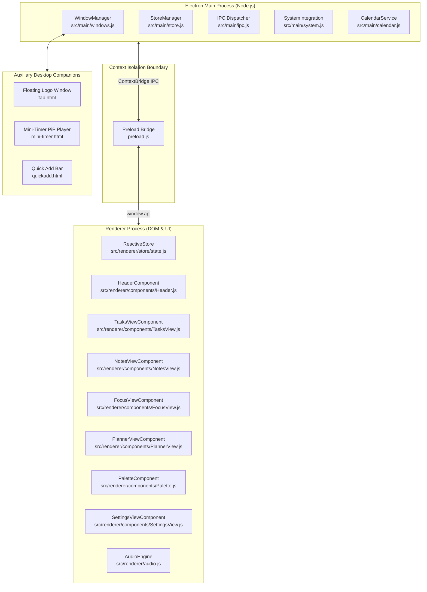

# Doing It — System Architecture & Maintenance Guide

> **Production Maintenance Reference**  
> *Target Audience: Core Engineers & Future Maintainers*  
> *Current Version: 4.3.2*

---

## Table of Contents
1. [System Overview & Architecture](#1-system-overview--architecture)
2. [Process Model & Isolation](#2-process-model--isolation)
3. [Window Management & Lifecycle](#3-window-management--lifecycle)
4. [Reactive Store & State Management](#4-reactive-store--state-management)
5. [Modular UI Components & Views](#5-modular-ui-components--views)
   - [Header & View Navigation](#header--view-navigation)
   - [Tasks Engine & Habit Tracking](#tasks-engine--habit-tracking)
   - [Notes & Instant Scratchpad](#notes--instant-scratchpad)
   - [Focus Studio & Ambient Audio Engine](#focus-studio--ambient-audio-engine)
   - [Day Planner & Calendar Synchronization](#day-planner--calendar-synchronization)
   - [Command Palette](#command-palette)
   - [In-App Settings & 1-Click Direct Uninstall](#in-app-settings--1-click-direct-uninstall)
6. [Design System & Theme Engine](#6-design-system--theme-engine)
7. [Audio Synthesizer Engine (Web Audio API)](#7-audio-synthesizer-engine-web-audio-api)
8. [Data Storage, Atomic Writes & Rolling Backups](#8-data-storage-atomic-writes--rolling-backups)
9. [IPC Communication Reference](#9-ipc-communication-reference)
10. [Packaging, NSIS Installer & App Icons](#10-packaging-nsis-installer--app-icons)
11. [Developer Workflows & How-To Guides](#11-developer-workflows--how-to-guides)

---

## 1. System Overview & Architecture

**Doing It** is a desktop productivity widget engineered for Windows 11. It blends the quick-capture mechanics of Things 3, the typography and themes of Linear, and the speed of Raycast into a lightweight, local-first frameless companion.

### High-Level Architecture


---

## 2. Process Model & Isolation

The application enforces strict Electron security best practices:
* `contextIsolation: true`
* `nodeIntegration: false`
* `sandbox: false` (to allow preload IPC)
* All file system operations, calendar network calls, and window resizing requests run in the Main process behind validated IPC channels in `preload.js`.

---

## 3. Window Management & Lifecycle

All browser windows are created, coordinated, and positioned in [`src/main/windows.js`](file:///c:/Users/Asus/Desktop/doingit/doing-it/src/main/windows.js):

| Window | Dimensions | File | Purpose & Invariants |
| :--- | :--- | :--- | :--- |
| **Main Window** | 400×650 (resizable: 360–680w, 520–max h) | `index.html` | Frameless (`frame: false, transparent: true`). Restores persisted dimensions on startup. Edge-docks with Windows screen borders. |
| **FAB Window** | 48×48 | `fab.html` | Draggable floating desktop companion. Displays the crisp app logo (`assets/icon.png`) with drop-shadow. Shown when main window is minimized. |
| **Mini-Timer** | 180×56 | `mini-timer.html` | Picture-in-Picture countdown pill. Standalone drag handle, play/pause toggle, linked task ticker, and restore button. |
| **Quick Add** | 520×68 | `quickadd.html` | Spotlight-style global capture bar triggered via shortcut (`Ctrl+Shift+N`). |

### Minimizing & Restoring
* When the user presses `Esc` or clicks Minimize in the header:
  1. Main window is hidden (`mainWindow.hide()`).
  2. If `disableFab` is `false` in settings, FAB window is displayed at its persisted desktop coordinates (`fabWindow.show()`).
* Clicking the floating logo immediately hides the FAB and brings the main window to the foreground (`mainWindow.show(); mainWindow.focus();`).

---

## 4. Reactive Store & State Management

The frontend state machine lives in [`src/renderer/store/state.js`](file:///c:/Users/Asus/Desktop/doingit/doing-it/src/renderer/store/state.js) (`ReactiveStore`):

* **Single Source of Truth**: Houses all in-memory arrays and flags (`tasks`, `notes`, `focus`, `calendarEvents`, `theme`, `activeView`, `scratchpad`, `settingsOpen`, `paletteOpen`).
* **Subscription Bus**: Components subscribe to individual slice keys (`store.subscribe('tasks', callback)`) or global updates (`'*'`).
* **Optimistic Local Updates**: Mutations update memory and re-render components immediately, then asynchronously persist to disk via `window.api.saveTodos()`, `window.api.saveNotes()`, or `window.api.saveSettings()`.
* **Store Hydration**: In `init()`, the store calls `window.api.getNotes()`, `getTodos()`, `getPomodoro()`, and `getSettings()`, then fires explicit notifications for `'tasks'`, `'notes'`, `'scratchpad'`, and `'focus'`.

---

## 5. Modular UI Components & Views

All components follow a clean lifecycle: `constructor(containerId, store)`, `render()`, `bindEvents()`, and reactive store subscriptions.

### Header & View Navigation
* File: [`src/renderer/components/Header.js`](file:///c:/Users/Asus/Desktop/doingit/doing-it/src/renderer/components/Header.js)
* **Two-Tier Layout**:
  - **Row 1 (`.header-bar`, 38px)**: Native drag region. Houses the Doing It logo, title (`white-space: nowrap`), live date pill, and five window control buttons (Command Palette, Theme Cycle, Settings, Minimize, Close).
  - **Row 2 (`.nav-bar`, 36px)**: Full-width segmented pill bar. Contains the four main view buttons (`Tasks`, `Notes`, `Focus`, `Planner`), each having `flex: 1` so tabs are evenly distributed and never wrap or clip.

### Tasks Engine & Habit Tracking
* File: [`src/renderer/components/TasksView.js`](file:///c:/Users/Asus/Desktop/doingit/doing-it/src/renderer/components/TasksView.js)
* **NLP Quick Add**: As the user types, debounced Chrono NLP extracts dates (`tomorrow 3pm`), priorities (`!high`, `!medium`), and habit flags (`/habit`).
* **Smart Sectioning**: Tasks are categorized into `Today`, `Upcoming`, `Backlog`, and `Completed`.
* **Daily Habits**: Habit items reset daily at midnight while preserving cumulative streak counts (`${streak}d`).
* **Task Focus Linkage**: Clicking **Focus** on any task transitions to the Focus Studio and links the task ID to the countdown timer.

### Notes & Instant Scratchpad
* File: [`src/renderer/components/NotesView.js`](file:///c:/Users/Asus/Desktop/doingit/doing-it/src/renderer/components/NotesView.js)
* **Auto-Saving Scratchpad**: Instant scratchpad area debounces inputs and persists directly into settings without requiring explicit save buttons.
* **Markdown Pipeline**: Notes support GitHub-flavored markdown, clickable hashtags (`#tag`), and interactive checklists (`- [ ]`, `- [x]`).
* **Tag Filtering**: Extracts all hashtags dynamically and renders a filter pill bar.
* **Initial Loading**: Feeds are rendered immediately in `constructor()` and updated whenever `'notes'` dispatches.

### Focus Studio & Ambient Audio Engine
* File: [`src/renderer/components/FocusView.js`](file:///c:/Users/Asus/Desktop/doingit/doing-it/src/renderer/components/FocusView.js)
* **Circular Countdown Ring**: High-precision SVG arc calculated via circumference `2 * Math.PI * 96` (`~603.18px`).
* **Picture-in-Picture Mini Timer**: Popping out launches `mini-timer.html` as a compact desktop companion.
* **Ambient Soundscapes**: Direct control over procedural audio soundscapes and volume.

### Day Planner & Calendar Synchronization
* File: [`src/renderer/components/PlannerView.js`](file:///c:/Users/Asus/Desktop/doingit/doing-it/src/renderer/components/PlannerView.js)
* **Week Strip**: 7-day interactive day picker centered around the selected date.
* **ICS Calendar Feed**: Fetches and parses `.ics` feeds from Google Calendar, Outlook, or Apple Calendar using line-unfolding algorithms.
* **1-Click Video Calls**: Automatically parses Google Meet, Zoom, Microsoft Teams, and Webex URLs and provides a direct "Join Meeting" action button.

### Command Palette
* File: [`src/renderer/components/Palette.js`](file:///c:/Users/Asus/Desktop/doingit/doing-it/src/renderer/components/Palette.js)
* Triggered globally via `Ctrl+K`. Provides fuzzy search across tasks, notes, calendar events, and core app navigation commands.

### In-App Settings & 1-Click Direct Uninstall
* File: [`src/renderer/components/SettingsView.js`](file:///c:/Users/Asus/Desktop/doingit/doing-it/src/renderer/components/SettingsView.js)
* Provides full control over themes, custom storage location, floating bubble toggle, autostart on Windows boot, and ICS calendar URL.
* **1-Click Uninstall**: Clicking "Uninstall Application" directly invokes `window.api.uninstallApp()`, which spawns `Uninstall Doing It.exe` and closes the app with zero confirmation dialogs.

---

## 6. Design System & Theme Engine

Styles are centralized in [`src/renderer/theme.css`](file:///c:/Users/Asus/Desktop/doingit/doing-it/src/renderer/theme.css).

### Design Tokens & Theme Palettes
The theme engine provides 7 rich palettes applied via `document.documentElement.setAttribute('data-theme', themeId)`:
1. **Obsidian Silver** (Default Dark, `:root`): Deep neutral slate with titanium silver accents (`#a2a2b0`).
2. **Midnight Blue** (`midnight`): Deep navy background with cyan sky accents (`#38bdf8`).
3. **Emerald Forest** (`emerald`): Deep forest background with emerald accents (`#10b981`).
4. **Warm Sunset** (`sunset`): Warm charcoal background with amber gold accents (`#f59e0b`).
5. **Crimson Rose** (`crimson`): Deep wine background with crimson rose accents (`#f43f5e`).
6. **Amethyst Violet** (`violet`): Dark grape background with violet purple accents (`#a855f7`).
7. **Daybreak Light** (`light`): Clean high-contrast light mode with sapphire blue accents (`#2563eb`).

### Invariant Contrast Rule
All components and interactive buttons must use semantic variables:
* Backgrounds: `var(--bg-app)`, `var(--bg-surface)`, `var(--bg-surface-hover)`, `var(--bg-input)`.
* Text: `var(--text-primary)`, `var(--text-secondary)`, `var(--text-muted)`.
* Borders: `var(--border-subtle)`, `var(--border-medium)`, `var(--border-highlight)`.
* **NEVER hardcode `rgba(255, 255, 255, ...)` or `rgba(0, 0, 0, ...)` for component backgrounds or text**, as this breaks inverted contrast in Daybreak Light mode.

---

## 7. Audio Synthesizer Engine (Web Audio API)

File: [`src/renderer/audio.js`](file:///c:/Users/Asus/Desktop/doingit/doing-it/src/renderer/audio.js)

Procedurally synthesizes ambient audio in real time using the browser's `AudioContext` without external audio files:
* **Brown Noise**: Multi-pole filtered noise buffer generating deep, soothing low-frequency rumble.
* **Rainfall**: Dual-generator combining white noise with random bandpass filters simulating water droplets.
* **Forest Breeze**: Pink noise modulated by low-frequency oscillators (LFO) creating wind dynamics.
* **Lo-Fi Calm**: Dual sine wave oscillators tuned with a 6Hz difference creating calming theta binaural beats.
* **UI Feedback**: Procedural pop sounds on task completion and timer chimes.

---

## 8. Data Storage, Atomic Writes & Rolling Backups

File: [`src/main/store.js`](file:///c:/Users/Asus/Desktop/doingit/doing-it/src/main/store.js)

* **Storage Location**: Defaults to `%APPDATA%\doing-it\doing-it-store.json`, or a user-selected directory (OneDrive/Dropbox).
* **Atomic File Writes**: Data is written to a temporary file (`doing-it-store.json.tmp`) and atomically renamed via `fs.renameSync()`, eliminating file corruption during power losses or sudden quits.
* **Rolling Startup Backups**: On each application launch, the current store is backed up to `%APPDATA%\doing-it\backups\doing-it-backup-YYYY-MM-DDTHH-mm-ss.json`. Up to 5 rolling backups are retained.
* **Corrupt Store Auto-Recovery**: If `doing-it-store.json` fails JSON parsing on boot, the latest valid rolling backup is automatically restored.

---

## 9. IPC Communication Reference

| Channel Name | Direction | Payload | Handler / Action |
| :--- | :--- | :--- | :--- |
| `get-todos` / `save-todos` | Two-way | Array of tasks | Read/write task records in `storeData.todos` |
| `get-notes` / `save-notes` | Two-way | Array of notes | Read/write note cards in `storeData.notes` |
| `get-pomodoro` / `save-pomodoro` | Two-way | Focus state object | Read/write timer state in `storeData.pomodoro` |
| `get-settings` / `save-settings` | Two-way | Settings object | Read/write user preferences in `storeData.settings` |
| `minimize-window` | Renderer → Main | None | Hides main window and opens FAB window |
| `close-window` | Renderer → Main | None | Gracefully closes application |
| `uninstall-app` | Renderer → Main | None | Executes `Uninstall Doing It.exe` directly |
| `choose-directory` | Two-way | None | Opens Windows folder picker dialog |
| `fetch-ics-calendar` | Two-way | URL string | Downloads and parses remote `.ics` feed |
| `fab-clicked` | FAB → Main | None | Restores main window from minimized state |
| `move-fab` | FAB → Main | `x, y` coords | Moves floating FAB window on desktop |
| `pop-out-timer` | Renderer → Main | Timer state | Hides main window and launches mini-timer PiP |
| `mini-timer-sync` | Two-way | Timer state | Syncs timer state between PiP and main store |

---

## 10. Packaging, NSIS Installer & App Icons

### Configuration in `package.json`
* **Packager**: `electron-builder --win`
* **Installer Format**: 1-Click NSIS (`oneClick: true, perMachine: false`)
* **Executable Icons**:
  - `build/icon.ico`: Multi-resolution Windows ICO (256x256, 48x48, 32x32, 16x16).
  - `afterPack.js`: Post-packaging hook utilizing `rcedit` to embed the icon directly into `dist/win-unpacked/Doing It.exe`.
  - `assets/icon.ico` & `assets/icon.png`: Runtime assets for window taskbar and FAB.
* **Installer Output**: Generated at `dist/Doing It Setup <version>.exe`.

---

## 11. Developer Workflows & How-To Guides

### Running Tests
```bash
# 1. Run Unit Tests (Store, Calendar, NLP, Component integrity)
npm test

# 2. Run E2E Smoke Tests across all 5 Windows
npm run test:e2e

# 3. Run Syntax & Linter Check
npm run lint
```

### Adding a New Theme
1. Open [`src/renderer/theme.css`](file:///c:/Users/Asus/Desktop/doingit/doing-it/src/renderer/theme.css).
2. Define a new selector: `[data-theme="your-theme-name"] { ... }`.
3. Provide the required tokens: `--bg-app`, `--bg-surface`, `--bg-surface-hover`, `--bg-input`, `--text-primary`, `--text-secondary`, `--text-muted`, `--border-subtle`, `--border-medium`, `--accent-primary`, `--accent-hover`, `--accent-glow`.
4. Register the theme in [`Header.js`](file:///c:/Users/Asus/Desktop/doingit/doing-it/src/renderer/components/Header.js) and [`SettingsView.js`](file:///c:/Users/Asus/Desktop/doingit/doing-it/src/renderer/components/SettingsView.js) in `this.themes`.

### Adding a New View / Tab
1. Add container element `<div id="view-newtab" style="display:none;"></div>` in `index.html`.
2. Add switcher tab button in [`Header.js`](file:///c:/Users/Asus/Desktop/doingit/doing-it/src/renderer/components/Header.js).
3. Create `src/renderer/components/NewTabView.js` extending the component pattern.
4. Mount component in `src/renderer/app.js` and include `newtab` in view-switching arrays.

### Building & Deploying Setup Exe
```bash
npm run build
```
The resulting installer is placed in `dist/Doing It Setup <version>.exe`.
