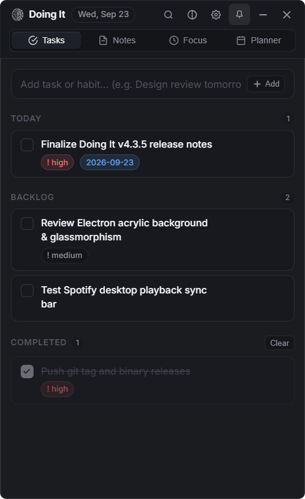
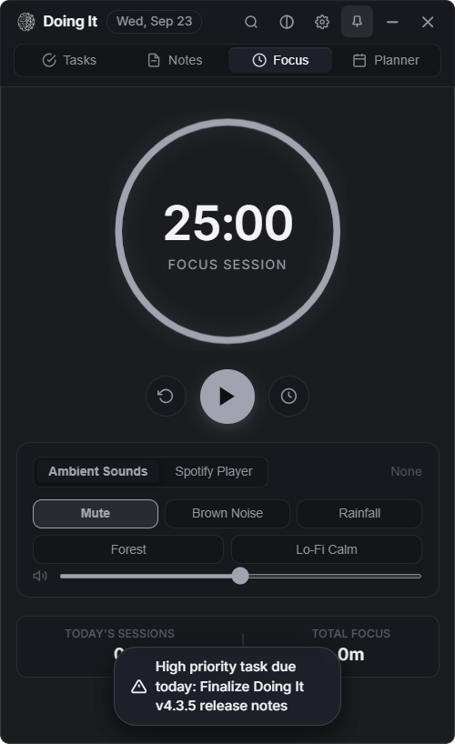
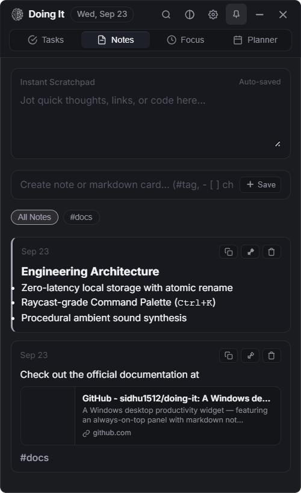
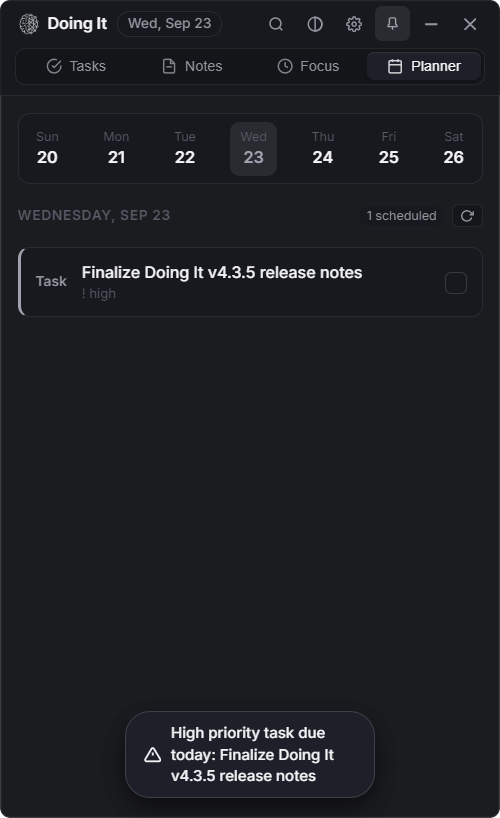
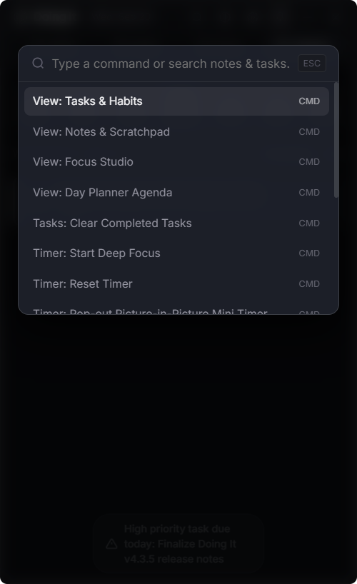
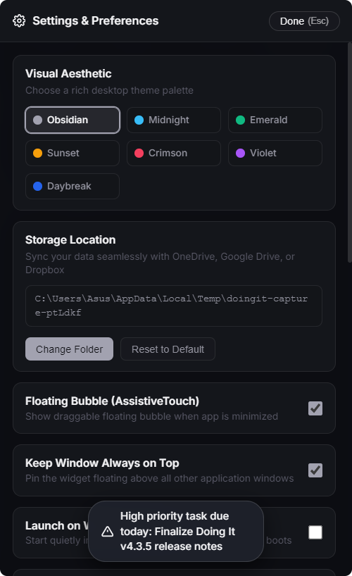
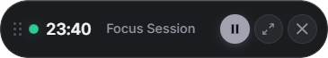
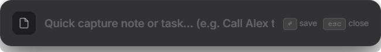

# Doing It

[](https://github.com/sidhu1512/doing-it/releases/download/v4.3.5/Doing.It.Setup.4.3.5.exe)
[](https://github.com/sidhu1512/doing-it/releases/tag/v4.3.5)
[](LICENSE)
[](https://github.com/sidhu1512/doing-it)

Doing It is a high-performance desktop productivity overlay engineered for Windows 11. Designed around local-first data ownership, zero-friction keyboard capture, and glassmorphic aesthetics, it unifies task tracking, markdown notes, procedural focus audio, and calendar synchronization into an always-accessible, frameless companion widget.

> [!NOTE]
> **Windows SmartScreen Alert during Installation**
> Because this is an open-source tool distributed directly without a corporate code-signing certificate, Windows Defender SmartScreen may display an "Unknown Publisher" prompt upon first running the installer.
> **Resolution:** Select **"More Info"**, then select **"Run Anyway"**.

---

## Visual Tour

<p align="center">
  
  
  
</p>
<p align="center">
  
  
  
</p>
<p align="center">
  
  
</p>

---

## Architectural Highlights

### Multi-Window Topology
* **Main Widget Panel** (`400x650px`, resizable): Frameless, transparent floating panel with custom native drag bar and hardware-accelerated frosted glass backdrop.
* **AssistiveTouch Floating Action Button (FAB)** (`48x48px`): Compact desktop companion button with real-time SVG timer progress ring. Minimizing the main window transitions state to the FAB without cluttering the taskbar.
* **Detached Picture-in-Picture Mini-Timer** (`290x50px`): Floating countdown pill with play/pause controls, task ticker, and direct completion toggle.
* **Spotlight Quick Add Bar** (`520x68px`): Global shortcut modal (`Ctrl+Shift+A`) featuring real-time natural language date and priority parsing.
* **In-App Preferences Panel**: Integrated modal settings interface (`Ctrl+,`) that never spawns external windows or breaks focus.

### Native Windows 11 Integration
* **Always-On-Top Window Pinning**: Quick-toggle pin button in header, settings, or command palette keeps the widget floating above code editors and browsers without losing focus.
* **Desktop Spotify Integration**: Inspects the local Windows Spotify process to display the live playing track and artist in Focus Studio with native Prev / Play-Pause / Next controls.
* **Proactive Meeting & Priority Task Alerts**: Background scheduler monitoring RFC 5545 calendar feeds and tasks, alerting 5 minutes before scheduled meetings via Web Audio chimes and Windows notifications.
* **Screen-Edge Docking**: Dragging the widget within 20px of any display boundary automatically docks it to the full height of the monitor's work area.
* **Context-Aware Foreground Capture**: Global shortcut (`Ctrl+Shift+C`) triggers an OS copy interrupt, extracts foreground window metadata via PowerShell WinAPI bindings (`user32.dll`), and attaches the active application title directly to the clipped note.
* **Focus Assist (Do Not Disturb) Automation**: Activating a focus session toggles the Windows Notification Center registry key (`NOC_GLOBAL_SETTING_TOASTS_ENABLED`), suppressing system notification banners during deep work.
* **Workstation Lock Detection**: Integrated power monitor listeners automatically pause active timers upon workstation lock (`Win+L`) and resume upon unlock.

---

## Core Feature Breakdown

### 1. Task Engine & Habit Tracking
* **Natural Language Processing (Chrono NLP)**: Real-time parsing of relative and absolute dates (e.g., "Review PR tomorrow at 3pm", "Ship release in 2 days"), priority indicators (`!high`, `!med`, `!low`), and habit flags (`/habit`).
* **Smart Sections**: Dynamic categorization across Today, Upcoming, Backlog, and Completed groups.
* **Habit Streaks with Midnight Reset**: Habits persist cumulative streaks while unchecking automatically at 00:00 without manual user intervention.
* **Task-Driven Focus Linkage**: Clicking the Focus action on any task links the task identifier to the countdown timer, logging accumulated focus duration directly upon completion.

### 2. Notes, Scratchpad & Media Pipeline
* **Auto-Saving Instant Scratchpad**: Debounced persistent buffer for rapid unstructured capture, saved directly without explicit submission.
* **GitHub Flavored Markdown (GFM)**: Full markdown pipeline with sanitized output, code block formatting, and auto-linked URLs.
* **Interactive Checklists**: Interactive checkboxes embedded within raw markdown text (`- [ ]` / `- [x]`) toggle state in place without requiring edit mode.
* **Universal Hashtags**: Dynamic aggregation of inline tags (`#architecture`, `#dev`) with a dedicated filter pill ribbon.
* **Clipboard Image Ingestion**: Direct paste support for screenshots (`Ctrl+V`), saving PNG assets into internal storage and rendering them via a secure local protocol (`doingit-media://`).
* **Rich OpenGraph Link Previews**: Automated metadata scraping for pasted URLs, rendering preview cards with titles, descriptions, and thumbnail graphics.

### 3. Focus Studio & Procedural Web Audio Engine
* **Circular Progress Arc**: High-precision SVG countdown visualization calculated via normalized circle circumference.
* **Zero-Asset Procedural Synthesizers**: Real-time synthesized ambient soundscapes generated mathematically using the Web Audio API without bundled MP3/WAV assets:
  * **Brown Noise**: Multi-pole filtered noise buffer producing low-frequency rumble.
  * **Rainfall**: Randomized bandpass filters and white noise simulating precipitation.
  * **Forest Breeze**: Pink noise modulated by low-frequency oscillation.
  * **Lo-Fi Calm**: Dual sinusoidal oscillators tuned with a 6Hz offset generating theta-wave binaural beats.
* **Acoustic Feedback**: Web Audio harmonic triad chimes (C5-E5-G5) on session completion and tactile pop feedback on task check-off.

### 4. Day Planner & RFC 5545 Calendar Synchronization
* **Interactive Week Strip**: 7-day horizontal date selector centered around the active schedule.
* **Line-Unfolding iCalendar Parser**: Native HTTP/HTTPS client fetching and unfolding RFC 5545 `.ics` feeds from Google Calendar, Microsoft Outlook, or Apple Calendar.
* **Meeting Link Extraction**: Regular-expression detection for Google Meet, Zoom, Microsoft Teams, and Webex URLs, exposing direct one-click join buttons in the agenda feed.

### 5. Command Palette (Ctrl+K)
* **Unified Fuzzy Search**: Rapid item matching across all tasks, notes, calendar events, and system commands.
* **Direct Navigation**: Instant keyboard jumping between application views and timer actions.

---

## Storage & Reliability Engineering

```
Data Flow:
[User Input] --> [ReactiveStore] --> [ContextBridge IPC] --> [StoreManager]
                                                                  |
                                                                  v
                                              [Atomic Staging: file.tmp]
                                                                  |
                                                                  v
                                                 [RenameSync: target.json]
                                                                  |
                                                                  v
                                              [Rolling Daily Backups (5d)]
```

* **Atomic File Writes**: Serializes updates to isolated temporary staging files (`doing-it-data.json.<timestamp>.tmp`) before executing atomic replacements via filesystem rename. Ensures resilience against sudden termination or power disruptions.
* **Bring Your Own Cloud (BYOC)**: Storage directories can be redirected to cloud-synchronized folders (OneDrive, Google Drive, Dropbox) while retaining local pointer references.
* **Automated Daily Backups**: Captures snapshot backups on application startup, enforcing a rolling 5-day retention policy with automatic corrupt-store self-healing.
* **Background Asset Garbage Collection**: Asynchronous background cleanup sweeps the local image directory 30 seconds post-boot, removing unreferenced image files.

---

## Design System & Theme Engine

Theme tokens are defined in `src/renderer/theme.css` and applied via the `data-theme` attribute:

| Theme Name | Identifier | Primary Accent | Background Base |
|---|---|---|---|
| Obsidian Silver | `:root` (default) | `#a2a2b0` | `rgba(13, 14, 18, 0.94)` |
| Midnight Blue | `midnight` | `#38bdf8` | `rgba(10, 14, 26, 0.95)` |
| Emerald Forest | `emerald` | `#10b981` | `rgba(9, 18, 14, 0.95)` |
| Warm Sunset | `sunset` | `#f59e0b` | `rgba(20, 16, 12, 0.95)` |
| Crimson Rose | `crimson` | `#f43f5e` | `rgba(22, 11, 16, 0.95)` |
| Amethyst Violet | `violet` | `#a855f7` | `rgba(17, 13, 26, 0.95)` |
| Daybreak Light | `light` | `#2563eb` | `rgba(248, 249, 251, 0.96)` |

---

## IPC Communication Architecture

The application strictly implements context isolation and security hardening:
* `contextIsolation: true`
* `nodeIntegration: false`
* `webSecurity: true` (with custom protocol `doingit-media://` for local asset isolation)

| Channel Name | Direction | Payload | Functional Responsibility |
|---|---|---|---|
| `get-todos` / `save-todos` | Two-way | Array of tasks | Read and write task entities |
| `get-notes` / `save-notes` | Two-way | Array of notes | Read and write note records |
| `get-pomodoro` / `save-pomodoro` | Two-way | Focus state object | Synchronize timer duration and session logs |
| `get-settings` / `save-settings` | Two-way | Settings schema | Update preferences and trigger live theme broadcast |
| `choose-directory` | Two-way | None | Invoke native Windows directory selection dialog |
| `get-current-store-path` | Two-way | None | Query resolved path of active data store |
| `quick-add-save` | Renderer -> Main | Raw string | Parse quick capture string and route to tasks or notes |
| `pop-out-timer` | Renderer -> Main | Timer state | Spawn detached Picture-in-Picture window |
| `mini-timer-update` | Renderer -> Main | Countdown state | Broadcast countdown ticks to FAB and PiP companions |
| `fetch-ics-calendar` | Two-way | URL string | Download remote iCalendar feed and parse events |
| `get-active-window` | Two-way | None | Execute cached PowerShell WinAPI foreground title query |
| `save-clipboard-image` | Two-way | None | Extract clipboard image data and serialize to PNG |
| `toggle-focus-assist` | Two-way | State ('on' / 'off') | Modify Windows Focus Assist registry value |
| `uninstall-app` | Renderer -> Main | None | Spawn uninstaller executable and terminate process |

---

## Keyboard Shortcuts

| Shortcut | Context | Functional Action |
|---|---|---|
| `Ctrl+Shift+N` | Global (OS-wide) | Toggle Main Widget visibility |
| `Ctrl+Shift+A` | Global (OS-wide) | Open Spotlight Quick Add dialog |
| `Ctrl+Shift+C` | Global (OS-wide) | Clip active selection with foreground window context |
| `Ctrl+K` | In-App | Open Raycast-style Command Palette |
| `Ctrl+,` | In-App | Toggle In-App Preferences Panel |
| `1`, `2`, `3`, `4` | In-App | Switch views (Tasks, Notes, Focus, Planner) |
| `↓` / `↑` | In-App | Navigate list items with luminous selection ring |
| `Space` | In-App | Toggle task completion checkbox |
| `Enter` | In-App | Edit highlighted task title inline or join meeting |
| `Delete` | In-App | Delete highlighted task or note card |
| `Esc` | In-App | Clear selection ring, dismiss modals, or minimize to FAB |

---

## Verification & Developer Workflows

### Prerequisites
* Node.js 18.x or 20.x
* Windows 10/11 x64 environment

### Installation & Execution
```bash
git clone https://github.com/sidhu1512/doing-it.git
cd doing-it
npm install
npm start
```

### Automated Test Suite
```bash
# Execute unit and component test suites
npm test

# Run syntax and linter checks
npm run lint

# Execute multi-window E2E smoke test
npm run test:e2e
```

### Production Build
```bash
# Package standard NSIS one-click installer
npm run build

# Package portable executable
npm run build:portable
```

The resulting installer is placed in `dist/Doing It Setup 4.3.5.exe`. Post-packaging hooks (`afterPack.js`) automatically patch the executable icon using `rcedit`.

---

## Invariant Constraints

The following structural configurations are mandatory for correct window rendering and must not be altered:
* `main.js`: Must configure `frame: false, transparent: true, backgroundColor: '#00000000'`.
* `src/renderer/theme.css`: Must apply `clip-path: inset(0 round 8px)` to `body` for clean anti-aliased border radius on transparent viewports.
* `afterPack.js`: Must patch icons directly into the packaged binary via `build/icon.ico`.

---

## License

Distributed under the [MIT License](LICENSE).
