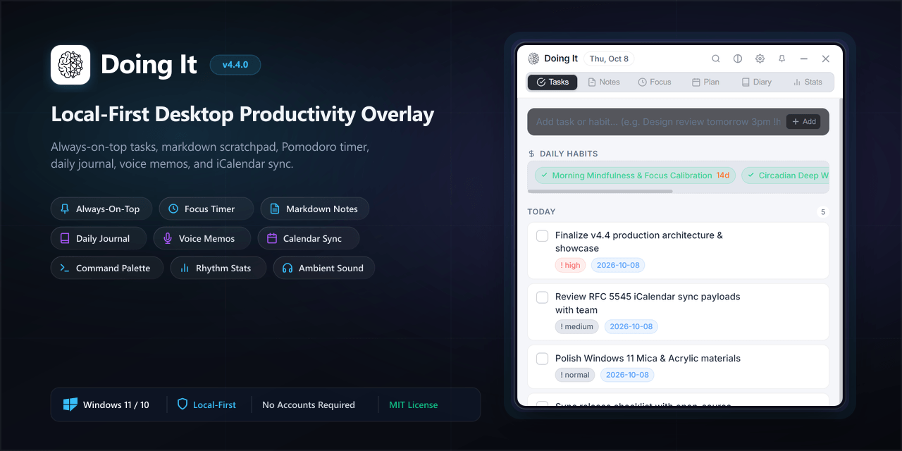
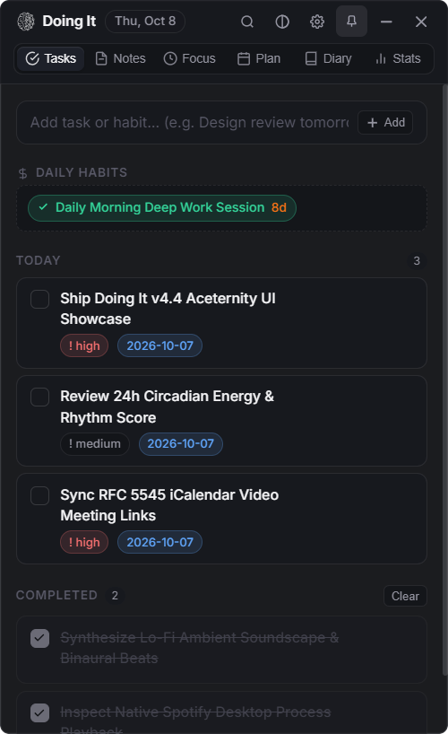
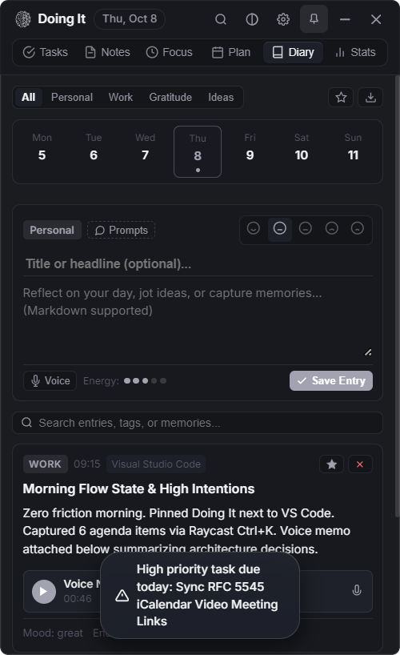
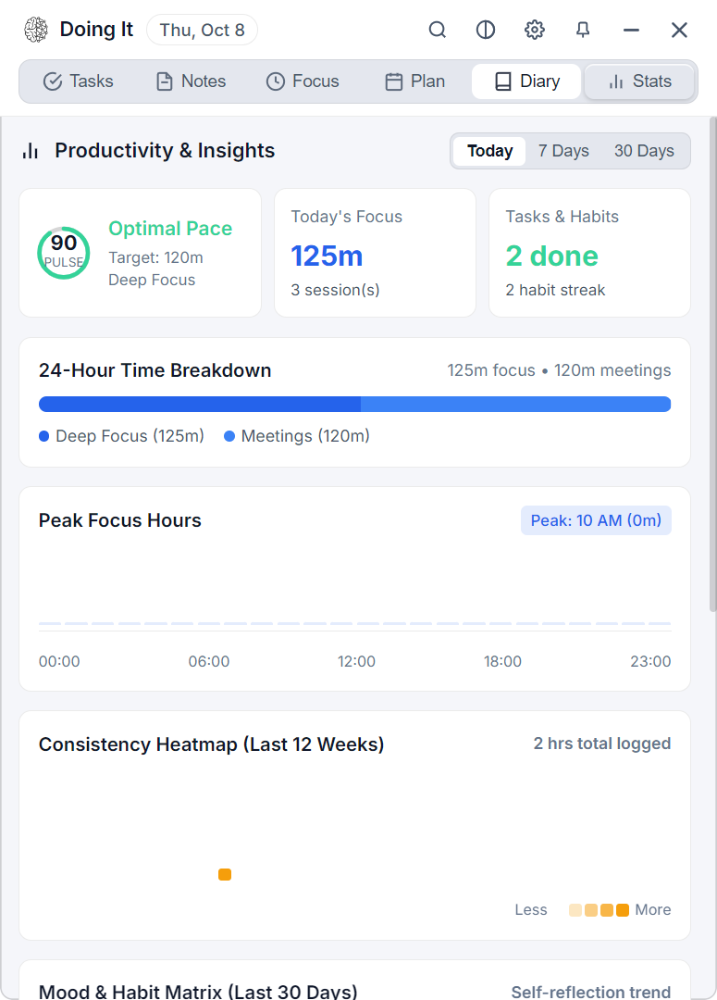
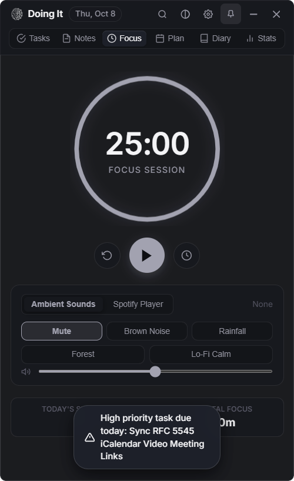
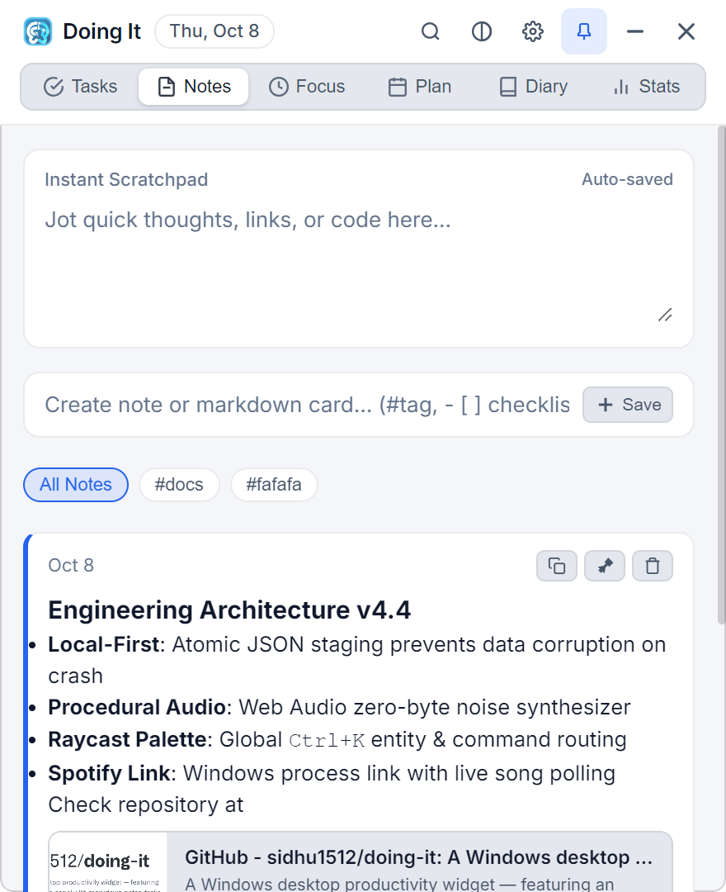
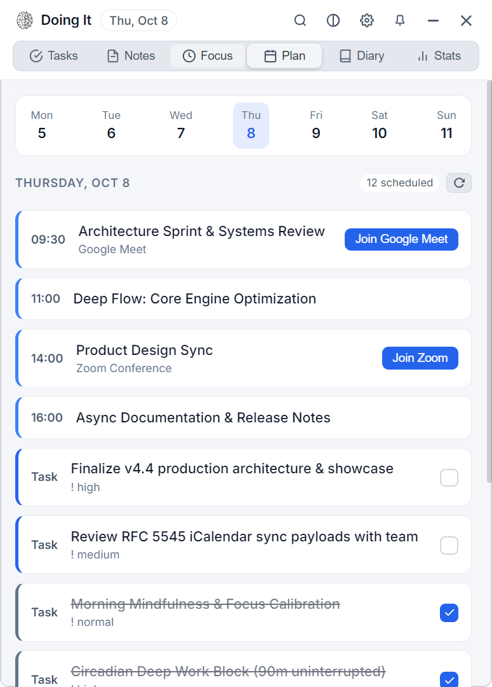

# Doing It

[](https://github.com/sidhu1512/doing-it/releases/download/v4.4.0/Doing.It.Setup.4.4.0.exe)
[](https://github.com/sidhu1512/doing-it/releases/download/v4.4.0/Doing.It.4.4.0.exe)
[](https://github.com/sidhu1512/doing-it/releases/tag/v4.4.0)
[](https://sidhu1512.github.io/doing-it/)
[](LICENSE)
[](https://github.com/sidhu1512/doing-it)

> **Local-first Windows widget: always-on-top tasks, markdown notes, Pomodoro focus timer, daily journal & calendar sync. Offline, no accounts. MIT.**

---

<p align="center">
  
</p>

---

## Installation & Distribution

### 1. Direct Downloads (Latest: v4.4.0)

| Package | Description | Download Link |
|---|---|---|
| **Windows Installer** | Recommended NSIS 1-click installer with Start Menu & Desktop shortcuts | [Doing.It.Setup.4.4.0.exe](https://github.com/sidhu1512/doing-it/releases/download/v4.4.0/Doing.It.Setup.4.4.0.exe) |
| **Portable Build** | Standalone single executable — runs instantly without installation | [Doing.It.4.4.0.exe](https://github.com/sidhu1512/doing-it/releases/download/v4.4.0/Doing.It.4.4.0.exe) |
| **Checksums** | SHA-256 verification hashes for all release artifacts | [SHA256SUMS.txt](https://github.com/sidhu1512/doing-it/releases/download/v4.4.0/SHA256SUMS.txt) |

#### Verifying SHA-256 Checksums
```powershell
# In PowerShell:
Get-FileHash .\Doing.It.Setup.4.4.0.exe -Algorithm SHA256
# Expected: 0D234D6D5DE3DE9721EDD018384813B4CACFBF4696BEFAF6920998BFBD9286BA

Get-FileHash .\Doing.It.4.4.0.exe -Algorithm SHA256
# Expected: 112ADCDB657CE503C9D61226027450A7D63B2387B1324580DB68626F41E005F1
```

---

### 2. Package Managers

```powershell
# Windows Package Manager (winget) — manifest submission in progress
winget install DoingIt.DoingIt

# Or run portable directly via PowerShell
Invoke-WebRequest -Uri "https://github.com/sidhu1512/doing-it/releases/download/v4.4.0/Doing.It.4.4.0.exe" -OutFile "$env:TEMP\DoingIt.exe"; Start-Process "$env:TEMP\DoingIt.exe"
```

---

### 3. Windows SmartScreen Notice

> [!NOTE]
> **Why does Windows SmartScreen appear?**  
> Doing It is an open-source community project distributed free of charge under the MIT license without an expensive commercial code-signing certificate ($400+/yr). Windows Defender SmartScreen may display an *"Unknown Publisher"* prompt when launching the executable for the first time.
>
> **How to proceed:**
> 1. Click **More info** on the SmartScreen dialog.
> 2. Click **Run anyway**.
>
> Doing It is 100% open source. Every line of code is auditable in this repository. We are actively pursuing free code signing through the SignPath Foundation.

---

## Features

<p align="center">
  
  
  
</p>
<p align="center">
  
  
  
</p>

### 1. Tasks & Habits
- **Natural Language Parsing**: Type `Ship feature tomorrow 3pm !high #launch /habit` — Chrono extracts dates, priorities, and tags instantly.
- **Smart Sections**: Dynamic categorization across Today, Upcoming, Backlog, and Completed buckets.
- **Habit Streaks**: Daily habit counters uncheck automatically at midnight without manual intervention.
- **Task Focus Linkage**: Clicking ▶ on any task links it directly to the Pomodoro timer, tracking accumulated minutes upon check-off.

### 2. Instant Markdown Notes
- **Debounced Auto-Saving Scratchpad**: Unstructured text persists immediately without requiring explicit save keystrokes.
- **Interactive Checklists**: Markdown `- [ ]` and `- [x]` checkboxes toggle in place without switching into edit mode.
- **Universal Hashtag Filtering**: Inline `#tags` dynamically populate filter pill ribbons.
- **Clipboard Image Ingestion**: Paste screenshots (`Ctrl+V`) directly into notes, saved securely to local disk.
- **Rich OpenGraph Link Previews**: External URLs automatically resolve into structured visual preview cards.

### 3. Focus Studio & Procedural Audio
- **Circular Countdown Ring**: High-precision SVG progress arc and timer.
- **Zero-Bandwidth Synthesizers**: Real-time ambient soundscapes generated mathematically via the Web Audio API without downloading audio files:
  - *Brown Noise*: Deep low-frequency rumble for concentration.
  - *Rainfall*: Randomized bandpass precipitation simulation.
  - *Forest Breeze*: Low-frequency modulated pink noise.
  - *Lo-Fi Calm*: 6Hz binaural theta beats.
- **Desktop Spotify Control**: Queries the local Windows Spotify process to display live track title and artist with play/pause/skip controls.
- **Windows Focus Assist**: Automatically suppresses Windows notification banners during active focus intervals.

### 4. Day Planner & Calendar Sync
- **Horizontal 7-Day Agenda**: Interactive week view centered around your schedule.
- **RFC 5545 iCalendar Feeds**: Direct HTTP/HTTPS line-unfolding sync with Google Calendar, Microsoft Outlook, Fastmail, or Apple iCloud feeds.
- **1-Click Meeting Join**: Regex extraction for Zoom, Microsoft Teams, Google Meet, and Webex meeting links.
- **Drag-and-Drop Scheduling**: Drag tasks directly onto calendar dates to reassign deadlines.

### 5. Daily Journal & Voice Reflections
- **Segregated Notebooks**: Organize entries across Daily, Work, Ideas, Gratitude, and Personal diaries.
- **Guided Prompts**: Spontaneous prompts for daily reflection and evening debriefs.
- **5-Point Emotional State Tracker**: Log mood and energy ratings (Joyful, Calm, Focused, Tired, Stressed) with visual glowing badges.
- **Audio Voice Memos**: Record voice notes with the Web MediaRecorder API. Local `.webm` recordings stream directly through an in-app waveform player.
- **Retrospective Timeline**: 7-day strip surfacing entries, starred bookmarks, and "On This Day" flashback memories.
- **Markdown Export**: One-click export to GitHub-Flavored Markdown (`.md`).

### 6. Productivity & Burnout Analytics
- **0–100 Circadian Rhythm Score**: Heuristic weighting task completions, deep focus blocks, and mood consistency.
- **24-Hour Work Curve & Peak Hours**: Identifies your highest-output focus hours throughout the day.
- **12-Week Activity Heatmap**: GitHub-style contribution matrix of focus blocks.
- **Burnout Guard**: Monitors continuous high-cognitive sessions, recommending rest breaks when fatigue thresholds are met.

---

## Privacy Policy & Network Model

Doing It is built around **strict local-first data ownership**.

### What Touches the Network?
- **Zero Telemetry**: No user analytics, no behavioral tracking, no telemetry beacons, no third-party tracking scripts.
- **No Cloud Accounts**: No logins, email registrations, passwords, or subscriptions. All data is saved on your local hard drive at `%APPDATA%/doing-it/doing-it-data.json`.
- **Network calls only happen for features you explicitly enable**:
  1. **Calendar Synchronization**: If you configure a private `.ics` URL in Settings, your local machine fetches the feed directly from your calendar host.
  2. **Link Previews**: If you paste an external URL into a note, an HTTP request fetches OpenGraph title and image metadata directly from the source host.
  3. **Procedural Ambient Sound**: 100% synthesized locally via the Web Audio API with zero audio file downloads or streaming bandwidth.

---

## Keyboard Shortcuts

| Shortcut | Context | Action |
|---|---|---|
| `Ctrl+Shift+N` | Global (Windows) | Toggle Main Widget visibility |
| `Ctrl+Shift+A` | Global (Windows) | Open Spotlight Quick Add dialog |
| `Ctrl+Shift+C` | Global (Windows) | Clip selected text with active foreground window context |
| `Ctrl+K` | In-App | Open Command Palette (fuzzy search & actions) |
| `Ctrl+,` | In-App | Open Preferences & Settings panel |
| `1` .. `6` / `Ctrl+1` .. `6` | In-App | Switch workspaces (Tasks, Notes, Focus, Planner, Diary, Stats) |
| `↓` / `↑` | In-App | Navigate list items with highlight ring |
| `Space` | In-App | Toggle highlighted task checkbox / Start or pause timer (in Focus view) |
| `Enter` | In-App | Edit highlighted task inline / Join meeting link |
| `Delete` | In-App | Delete highlighted task or note |
| `Esc` | In-App | Dismiss palette/modals or minimize to floating companion orb |

---

## Comparison: Doing It vs Other Tools

| Feature | Doing It | Todoist | Windows Sticky Notes | Notion |
|---|:---:|:---:|:---:|:---:|
| **Always-On-Top Windows Overlay** | :white_check_mark: | :x: | :white_check_mark: | :x: |
| **Local-First (No Account Required)** | :white_check_mark: | :x: | :x: | :x: |
| **Zero Telemetry / Total Privacy** | :white_check_mark: | :x: | :x: | :x: |
| **Offline Synthesized Ambient Audio** | :white_check_mark: | :x: | :x: | :x: |
| **Integrated Daily Journal & Audio Memos**| :white_check_mark: | :x: | :x: | :white_check_mark: |
| **Circadian Rhythm & Burnout Analytics** | :white_check_mark: | :x: | :x: | :x: |
| **RFC 5545 iCalendar Feeds** | :white_check_mark: | :white_check_mark: | :x: | :white_check_mark: |
| **Command Palette & Hotkeys** | :white_check_mark: | :white_check_mark: | :x: | :white_check_mark: |
| **License & Pricing** | **Free & MIT Open Source** | Freemium ($5/mo) | Free (Proprietary) | Freemium ($10/mo) |

---

## Frequently Asked Questions (FAQ)

### What Windows versions are supported?
Doing It is built and verified for 64-bit **Windows 11** and **Windows 10 (version 1809 and later)**. On Windows 11 it supports native Mica acrylic materials, with dark/light surface fallback on Windows 10.

### Where is my data saved, and can I sync across devices?
All data is stored on your machine in `%APPDATA%/doing-it/doing-it-data.json`. In Settings, you can set a custom storage folder (such as a local OneDrive, Dropbox, or Syncthing folder) to sync across your own machines without third-party cloud servers.

### Can I run Doing It without installing it?
Yes! Download the [Portable Build (`Doing.It.4.4.0.exe`)](https://github.com/sidhu1512/doing-it/releases/download/v4.4.0/Doing.It.4.4.0.exe). It runs as a self-contained executable from any folder or USB drive.

### How does Doing It protect against data loss?
All saves use atomic filesystem replacement via temporary staging files (`.tmp`) and synchronous renames. Additionally, Doing It creates automated rolling 5-day snapshot backups in `%APPDATA%/doing-it/backups/`.

---

## Development & Contributing

We welcome community contributions, bug fixes, and feature ideas!

- **Contributing Guide**: See [`CONTRIBUTING.md`](CONTRIBUTING.md) for local development instructions, test suites, and PR conventions.
- **Technical Architecture & IPC Catalog**: Detailed process models, IPC channel tables, and window invariants are documented in [`DOCUMENTATION.md`](DOCUMENTATION.md).
- **Code of Conduct**: Governed by the Contributor Covenant in [`CODE_OF_CONDUCT.md`](CODE_OF_CONDUCT.md).
- **Security Policy**: Read our vulnerability disclosure policy in [`SECURITY.md`](SECURITY.md).

```bash
# Clone the repository
git clone https://github.com/sidhu1512/doing-it.git
cd doing-it

# Install dependencies and start
npm install
npm start

# Run automated tests and linting
npm test
npm run lint
```

---

## License

Distributed under the permissive **[MIT License](LICENSE)**. Free for personal, commercial, and educational use.
